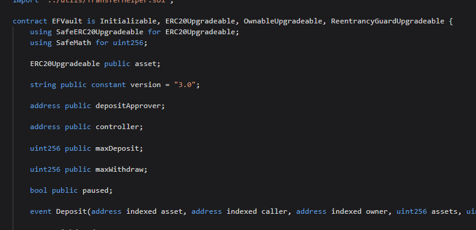
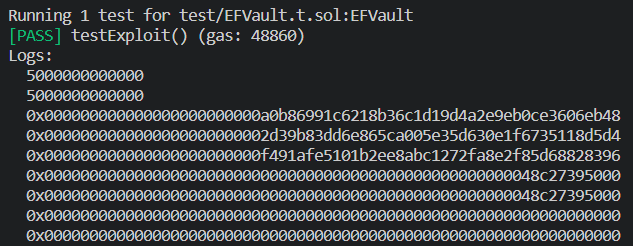
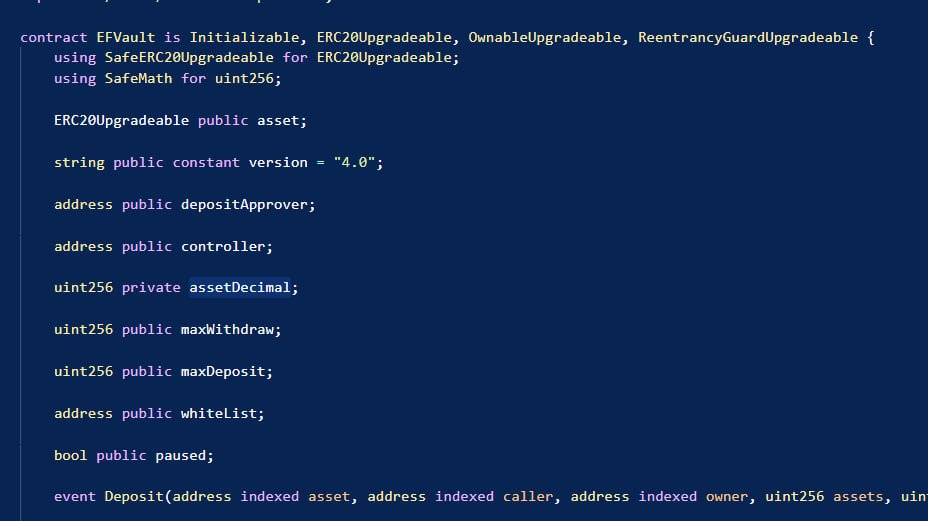
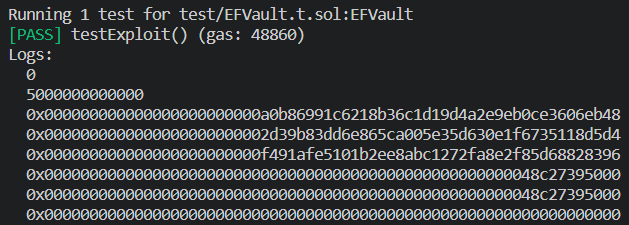

## 插槽冲突

### 合约升级前


```solidity
function testExploit() external {
    console2.log(ENF.maxDeposit());
    console2.log(ENF.maxWithdraw());
    for (uint256 i = 1; i < 15; i++) {
        emit log_bytes32(vm.load(address(ENF),bytes32(200+i)));
    }
}
```
查看一下之前的插槽

可以看到此时`maxDeposit`和`maxWithdraw`的值都是`5000000000000`，正常。

### 合约升级后


可以发现`assetDecimal`被直接插在了`maxDeposit`的位置，并且将`maxDeposit`和`maxWithdraw`向后移动了一个插槽。
由于代理合约使用的是`delegatecall`，所以调用`assetDecimal`的时候，实际会返回`maxDeposit`的值。



此时发现，slot的内容虽然没有改变，但是`maxDeposit`变成了0，所以此时`assetDecimal`的值也变成了5000000000000。

### 漏洞复现
```solidity
function redeem(uint256 shares, address receiver)
    public
    virtual
    nonReentrant
    unPaused
    onlyAllowed
    returns (uint256 assets)
{
    require(shares > 0, "ZERO_SHARES");
    require(shares <= balanceOf(msg.sender), "EXCEED_TOTAL_BALANCE");

    assets = (shares * assetsPerShare()) / 1e24;

    require(assets <= maxWithdraw, "EXCEED_ONE_TIME_MAX_WITHDRAW");

    // Withdraw asset
    _withdraw(assets, shares, receiver);
}

function _withdraw(
    uint256 assets,
    uint256 shares,
    address receiver
) internal {
    // Calls Withdraw function on controller
    (uint256 withdrawn, uint256 fee) = IController(controller).withdraw(assets, receiver);
    require(withdrawn > 0, "INVALID_WITHDRAWN_SHARES");

    // Burn shares amount
    _burn(msg.sender, shares);

    emit Withdraw(address(asset), msg.sender, receiver, assets, shares, fee);
}

function assetsPerShare() internal view returns (uint256) {
    return (IController(controller).totalAssets(false) * assetDecimal * 1e18) / totalSupply();
}
```
assetDecimal的错误值，使得assetsPerShare的值变得巨大，导致redeem的时候，填入非常小的shares，也能取出非常多的资产。

https://etherscan.io/tx/0x1fe5a53405d00ce2f3e15b214c7486c69cbc5bf165cf9596e86f797f62e81914

该笔交易中，攻击者仅传入了676562 shares，但是取出了巨额的DAI和USDC。

## 总结

可升级合约在升级时要加入新变量，一定要加入在之前变量的**后面**